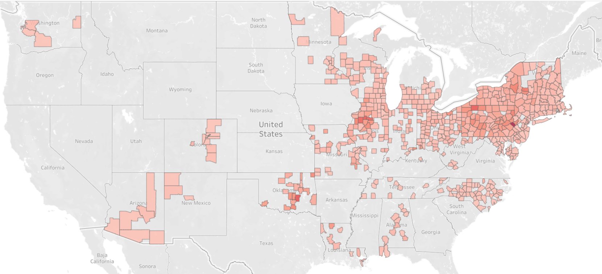

# Lead_Research

My Research on Lead Toxicity

 
<a href = "https://public.tableau.com/app/profile/brian5756/viz/AdolescentLeadExposureRatesbyCounty/ElevatedAdoloscentLeadRatesbyCounty">Interactive Link</a>
Children under 72 months who have elevated levels of lead in their blood

<h5>Skills Used:</h5>
<pre>
     - Cloud API
         - Connect to Google Cloud
         - Upload data to Google Sheets through API
         
     - Python
         - Jupyter Notebook
         - Basic Python
         - Pandas
         
      - Database
         - PostgreSQL Configuration and Querying
         
      - Data Cleaning
         - Excel/Google Spreadsheets
         - SQL
            - Aggregate Functions
            - Converting Date Types
            - Creating Views
            
      - Data Visualization
         - Tableau
</pre>
